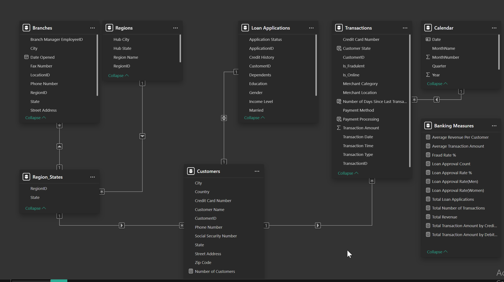
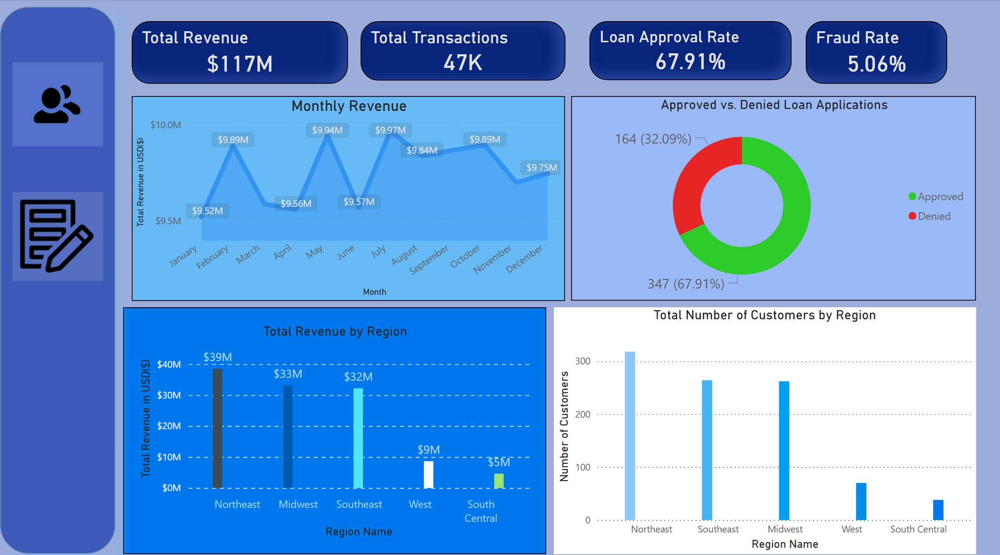
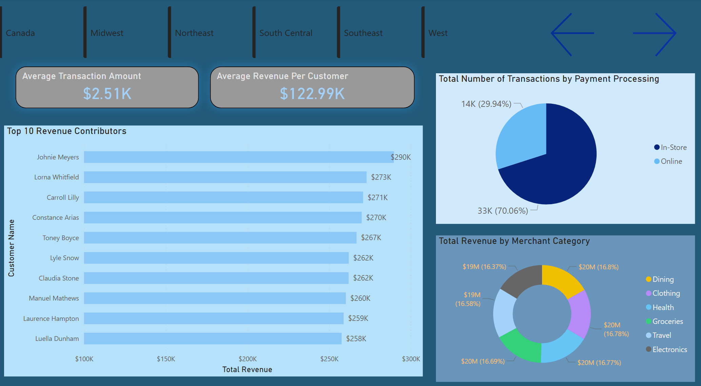
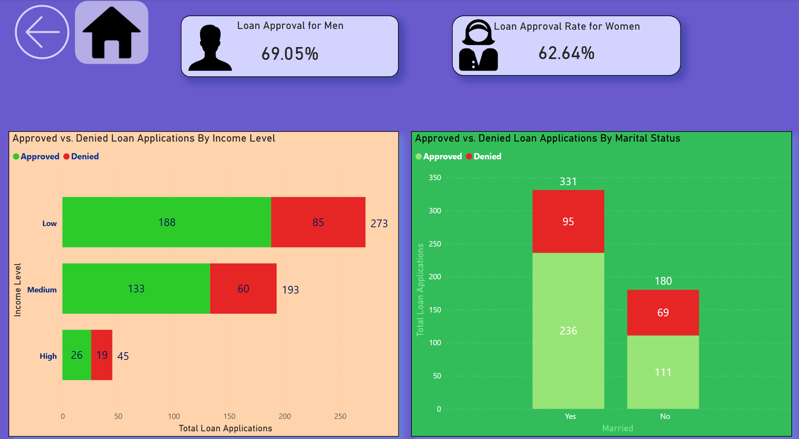

# Banking Customer & Loan Analytics (Power BI)


---

## Overview

This project simulates a real-world business intelligence engagement for a regional banking corporation.  
The objective was to develop an interactive Power BI dashboard that provides executive-level insight into:

- Customer transaction behavior  
- Revenue performance  
- Fraud monitoring  
- Loan application trends and approval rates  

The final deliverable is a multi-page Power BI report designed for leadership decision-making.

---

## Business Objectives

- Analyze total revenue and transaction trends  
- Identify high-value customers  
- Monitor fraud rate percentage  
- Evaluate loan approval performance  
- Compare approval rates across income level, employment type, education, and marital status  

---

## Data Model

The report is built using a star-schema design:

- **Customers** → Dimension  
- **Calendar** → Dimension  
- **Transactions** → Fact table  
- **Loan Applications** → Fact table  

Relationships:

- customers[customer_id] (1) → transactions[customer_id] (*)  
- customers[customer_id] (1) → loan_applications[customer_id] (*)
- 


---

## Data Preparation

Data was extracted from a MySQL relational database and loaded into Power BI using Power Query.

Transformations included:

- Creating a Transaction Date column using M code  
- Merging customer name fields  
- Cleaning categorical inconsistencies (Approved/Denied, Yes/No)  
- Converting financial fields to fixed decimal format  
- Building a Calendar table for time intelligence  

---

## Key DAX Measures

The following measures were developed:

- **Total Number of Transactions**
- **Total Revenue**
- **Average Transaction Amount**
- **Fraud Rate %**
- **Total Loan Applications**
- **Loan Approval Count**
- **Loan Approval Rate %**
- **Average Revenue per Customer**

These KPIs allow leadership to evaluate both operational and lending performance at a glance.

---

## Dashboard Pages

### Executive Overview

- KPI cards (Revenue, Transactions, Fraud Rate, Approval Rate)
- Revenue trend over time
- Loan approval breakdown
- High-level performance indicators



---

### Customer Transaction Analysis

- Top 10 customers by revenue
- Online vs. in-store transactions
- Merchant category breakdown
- Revenue distribution analysis



---

### Loan Application Insights

- Approval rate by income level
- Approval rate by employment type
- Approval rate by education
- Approval rate by marital status
- Property area analysis



---

## Executive Insights

- The Northeast region generates the highest revenue and customer volume.
- 70% of transactions occur in physical retail environments.
- Fraud rates remain relatively low but require continuous monitoring.
- Loan approval rates vary significantly by income level and marital status.
- Male applicants show a slightly higher approval rate compared to female applicants.

These findings support strategic marketing alignment and enhanced credit risk evaluation.

---

## Project Structure

```text
banking-customer-loan-analytics/
├── documentation
│   └── Data_Model.png
├── pbix
│   └── Banking_Customer_Loan_Analytics.pbix
├── screenshots
│   ├── Executive_Overview.png
│   ├── Customer_Transactions.png
│   └── Loan_Applications.png
├── README.md
└── LICENSE
```

---

## Technologies Used

- **Power BI** – Dashboard development & data modeling  
- **DAX** – KPI and metric calculations  
- **Power Query (M)** – Data transformation  
- **MySQL** – Data storage and extraction  

---

## Author

**© 2026 Kenye Mays**

[LinkedIn](https://www.linkedin.com/in/kenye-mays/)  
[Portfolio Website](https://pskmays.github.io/portfolio/)  

---

## Contact

For questions, collaboration, or opportunities:  
📩 kenyemays00@gmail.com
